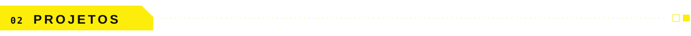
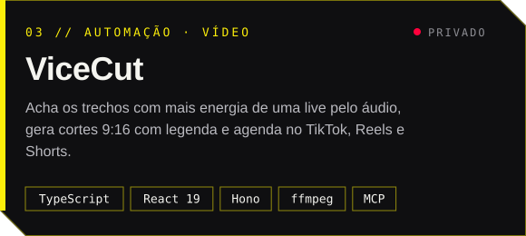
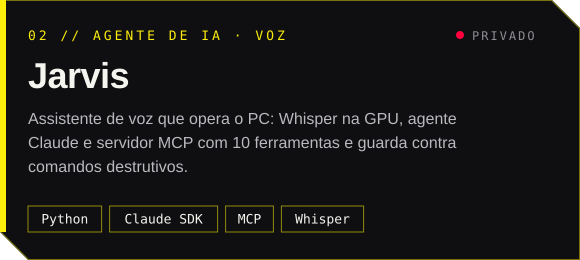
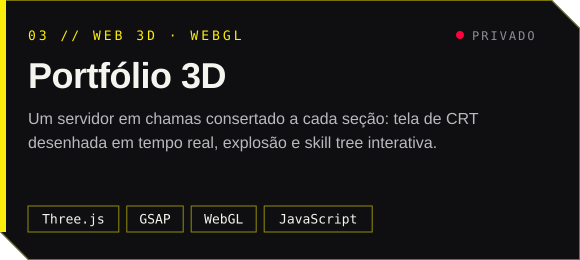
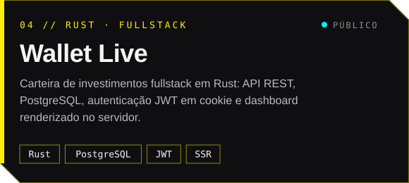

<a href="https://www.leandromaiscedo.dev">
  
</a>

<p align="center">
  <a href="https://www.leandromaiscedo.dev"></a>
  <a href="https://www.linkedin.com/in/leandromlmoreiradev/"></a>
  <a href="mailto:leandromlmoreira@hotmail.com"></a>
</p>

<br />


Desenvolvedor full stack. Construo produtos web **do banco de dados até a tela**: plataformas com pagamentos, integrações e LGPD, e **agentes de IA que operam ferramentas de verdade** via MCP.

```ts
const leandro = {
  cargo:      "Desenvolvedor Full Stack @ LVES · Lojas Virtuais e Sites",
  foco:       ["Agentes de IA com MCP", "Web 3D", "Plataformas com pagamentos"],
  agora:      "plataforma de assinaturas com Stripe + PIX, LGPD e gamificação",
  estudando:  ["Rust", "Arquitetura de dados", "IA generativa"],
  local:      "Iguaba Grande, RJ · remoto ou híbrido",
};
```

<br />



<table>
  <tr>
    <td width="50%"><a href="https://github.com/leandromlmoreira/vicecut"></a></td>
    <td width="50%"><a href="https://www.leandromaiscedo.dev"></a></td>
  </tr>
  <tr>
    <td width="50%"><a href="https://www.leandromaiscedo.dev"></a></td>
    <td width="50%"><a href="https://github.com/leandromlmoreira/rust-fullstack-carteira-investimentos"></a></td>
  </tr>
</table>

<br />


<p align="center">
  <br />
  <br />
  
</p>

<br />


| Bootcamps | Formações |
|---|---|
| **Rust AI Developer** · Santander 2026 | **TypeScript Fullstack Developer** |
| **Java com AWS** · GFT Start #7 | **SQL Database Specialist** |
| **IA e Arquitetura de Dados** · Aceleração Microsoft | **React Native Developer** |
| | **Lógica de Programação** |

<br />


<p align="center">
  
</p>

<picture>
  <source media="(prefers-color-scheme: dark)" srcset="https://raw.githubusercontent.com/leandromlmoreira/leandromlmoreira/output/snake-dark.svg" />
  
</picture>

<br />


<p align="center">
  Tem um projeto, uma vaga ou uma ideia? Me chama.<br /><br />
  <a href="https://www.linkedin.com/in/leandromlmoreiradev/"></a>
  <a href="mailto:leandromlmoreira@hotmail.com"></a>
  <a href="https://www.instagram.com/leandromaiscedo"></a>
  <a href="https://www.leandromaiscedo.dev"></a>
</p>
